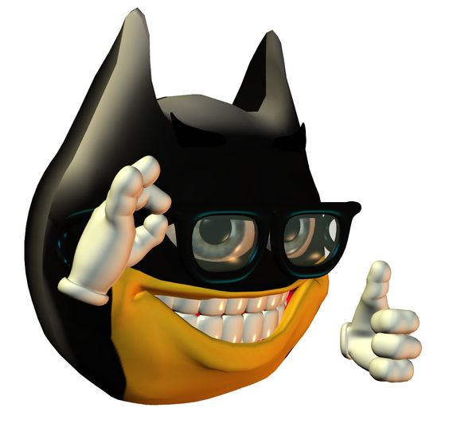

<!-- Heading -->
# Titulo 1
## Titulo 2
### Titulo 3
#### Titulo 4
##### Titulo 5
###### Titulo 6

<!-- Cursiva -->
Este es un *texto* en cursivo

<!-- negrilla -->
Este es un **texto** en negrilla

<!-- Rayado -->
Este es un ~~texto~~ rayado

<!-- Ul -->
- Esta es una lista no ordenada
    * Este es un sub punto
1. Esta es una lista ordenada
    1. Este es un sub punto

<!-- Enlaces a una web -->
[Google](https://www.google.com "Custom tittle")

<!-- Citas -->
> this is a quote

<!-- Etiqueta <hr> -->
---
___

<!-- Codigo -->

`Console.log('Hello world')`

<!-- Añadir el lenguaje para resaltarlo -->
``` java
public static int[][] createCOLFlag(int height,int width){
        int[][] flag=new int[height][width];
        int rowInt=0;
        int rowEnd=0;

        rowInt=0;
        rowEnd=(int)(height*0.50);
        for (int row=rowInt; row< rowEnd;row++){
            for (int cell=0;cell<flag[row].length;cell++)
                flag[row][cell]=COLOR_YELLOW;
        }

```

<!-- Tablas -->
|    Tabla     |     Condicion  |
| ------------ | -------------- |
| First value  |   Conclution   |
| Second value  |   Conclution   |

<!-- Imagen -->


<!-- MarkDown Rules on Github -->
Esto es un "tutu"
* [x] Task 1
* [ ] Task 2
* [x] Task 3
* [ ] Task 4
